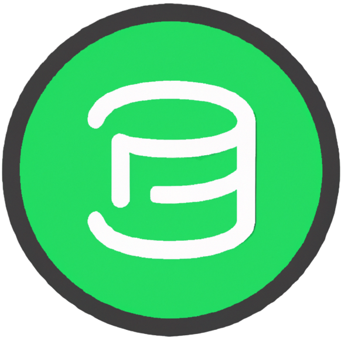
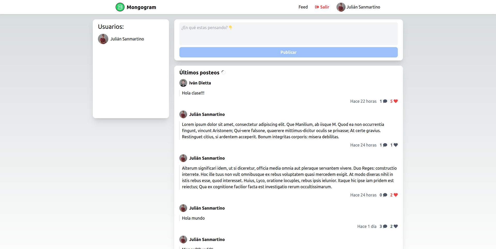

# Mongogram


Mongogram es una aplicación hecha con fines educativos, y funciona como una mini red social básica. Se pueden crear
posts y ver los posts de los demás usuarios. Para acceder deberás vincular tu cuenta de Google. 👇

[Demo](https://mongogram.vercel.app/)

## Setup

1. Prerequisitos: Node.js v18.10, MongoDB, Credenciales de Google OAuth
2. Instalar paquetes de Node.js: `npm install`
3. Crear archivo `.env` en la raíz del proyecto con las siguientes variables de entorno:

```
# Url del proyecto
NEXT_AUTH_URL=http://localhost:3000
# String aleatoria para encriptar las cookies
NEXTAUTH_SECRET=secret

# Datos para la autenticación con Google
GOOGLE_CLIENT_ID=
GOOGLE_CLIENT_SECRET=

# Url de la base de datos de MongoDB
MONGODB_URI=
```
4. Ejecutar el proyecto con `npm run dev`

## Objetivos del desarrolo
1. Aprender a utilizar Next.js v13, con Server Components y demás funcionalidades nuevas
2. Demostrar el uso de una base de datos Documental (MongoDB)
3. Tener un ejemplo para compartir en clase acerca del funcionamiento de MongoDB